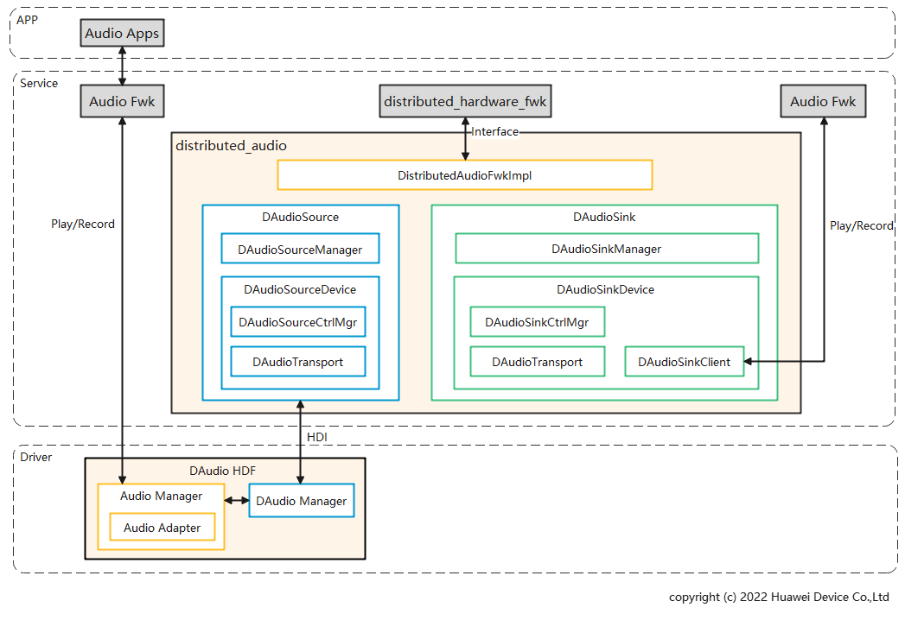

# **分布式音频部件**

## **简介**

分布式音频是指多个设备的音频协同使用能力，如将设备A的音频通过设备B的Speaker进行播音，或者设备A使用设备B的Mic进行录音。分布式音频不直接向应用提供接口，应用可以通过[音频框架](https://gitee.com/openharmony/multimedia_audio_framework)的接口来使用分布式音频，从而操作其他设备的音频外设实现播音和录音，使用方式与本地音频一致。

### **概念说明**
主控端（source）：控制端，通过分布式音频向其他设备发送命令，实现在其他设备上音频播放、录音功能；  
被控端（sink）：被控制端，接收主控端设备的命令，使本地音频外设为主控端设备所用，用来播音或录音。

### **场景说明**
两台设备完成组网后，主控端设备就可以查询到被控端设备，并像使用本地音频一样使用被控端设备的音频外设完成播音和录音。被控端设备下线即组网关系断开后，将会无法查询到被控端设备。

### **流程说明**
#### **1. 设备组网上线**
设备组网后，分布式硬件管理框架同步到上线设备的音频硬件信息并对所上线的音频设备进行使能，使能成功后在系统中会新增分布式音频驱动并通知到音频框架，音频框架统一管理本地音频和分布式音频驱动；上层应用通过音频框架接口可以查询到分布式音频设备。

#### **2. 设备使用**
应用可以通过音频框架接口使用分布式音频的能力，调用被控端设备的Speaker进行播音，或者调用被控端设备的Mic进行录音。

#### **3. 设备下线**
设备下线后，分布式硬件管理框架去使能下线设备的音频硬件，本地移除分布式音频驱动并通知到音频框架，此时下线设备的分布式音频不可用。

### **架构实现**

系统架构图如下图所示：



**分布式音频框架实现(DistributedAudioFwkImpl)**：为分布式硬件管理框架提供分布式音频初始化、释放、使能、去使能能力，以及音频设备配置参数能力。

**分布式音频主控端管理模块(DAudioSourceManager)**：主控端音频设备管理模块。

**分布式音频被控端管理模块(DAudioSinkManager)**：被控端音频设备管理模块。

**主控端分布式音频设备抽象实体(DAudioSourceDevice)**：被控端设备在主控端设备的抽象，实现被控端音频设备音量、焦点、媒体键事件的控制。当执行录音功能时，该模块接收从被控端设备传来的音频编码数据，完成解码操作后，将音频流送给主控端音频框架。当执行放音功能时，该模块接收主控端音频框架传递的音频流，进行编码处理后，将编码数据发送给被控端设备。

**被控端分布式音频源设备抽象实体(DAudioSinkDevice)**：主控端设备在被控端设备的代理，实现对主控端发送的音量、焦点、媒体键事件的响应和处理。当执行录音功能时，该模块接受本地采集音频流，进行编码处理后，将编码数据发送给主控端设备。当执行放音功能时，该模块接收从主控端设备传来的音频流数据，完成解码操作，送给本地音频框架进行播放。

**分布式音频主控端控制管理模块(DAudioSourceCtrlMgr)**：负责响应被控端设备媒体键事件、主控端设备与被控端设备之间音量同步、响应被控端设备音频焦点状态等任务的处理。

**分布式音频被控端控制管理模块(DAudioSinkCtrlMgr)**：负责监听被控端设备的音量、音频焦点状态、媒体键事件，执行主控端设备音量调节指令、反馈被控端设备音频焦点状态和被控端设备媒体键事件。

**分布式音频被控端传输处理模块(DAudioTransport)**：负责主控端设备和被控端设备之间音频数据的处理和传输，包括音频编码、音频解码、音频数据发送、音频数据接收等操作。

**分布式音频被控端代理模块(DAudioSinkClient)**：与被控端音频框架交互，完成音频流的播放或者采集。

**HDF分布式音频设备管理扩展模块(DAudio Manager)**：负责分布式音频驱动与分布式音频服务间的交互，包括设备注册、去注册、打开、关闭等。

**HDF分布式音频设备管理模块(Audio Manager)**：负责创建和管理驱动层音频设备，与音频框架跨进程交互，通知设备上下线状态。

**HDF分布式音频设备驱动实体(Audio Adapter)**：是远端设备在驱动层的抽象，负责执行和转发具体驱动层的事件。


## **目录**

```
/foundation/distributedhardware/distributed_audio
├── audio_handler                          # 分布式音频硬件信息上报、设备状态变化通知，由分布式硬件管理框架加载
├── common                                 # 分布式音频公共模块
├── interfaces                             # 分布式音频对外接口模块
├── sa_profile                             # 分布式音频SA配置模块
├── hdf_interface                          # 分布式音频hdf接口模块
├── hdf_service                            # 分布式音频hdf服务模块
├── services                               # 分布式音频服务模块
│   ├── audioclient                        # 分布式音频客户端
│   ├── audiocontrol                       # 分布式音频控制管理模块
│   ├── audiohdiproxy                      # 分布式音频HDI代理模块
│   ├── audiomanager                       # 分布式音频服务管理模块
│   ├── audioprocessor                     # 分布式音频数据处理模块，包括编码，解码等
│   ├── audiotransport                     # 分布式音频数据传输组件
│   ├── common                             # 分布式音频服务公共模块
│   └── softbusadapter                     # 软总线接口适配器，为音频事件传输提供统一传输接口
```

## **约束**
**语言限制**：C++语言。  
**组网环境**：必须确保设备在同一个局域网中。  
**操作系统限制**：OpenHarmony标准操作系统。  

## **相关仓**
****
**分布式硬件子系统：**

设备管理
[device_manager](https://gitee.com/openharmony/distributedhardware_device_manager)

分步式硬件管理框架
[distributed_hardware_fwk](https://gitee.com/openharmony/distributedhardware_distributed_hardware_fwk)

分布式相机
[distributed_camera](https://gitee.com/openharmony/distributedhardware_distributed_camera)

分布式屏幕
[distributed_screen](https://gitee.com/openharmony/distributedhardware_distributed_screen)

分布式输入
[distributed_input](https://gitee.com/openharmony/distributedhardware_distributed_input)

**分布式音频**
[distributed_audio](https://gitee.com/openharmony/distributedhardware_distributed_audio)
